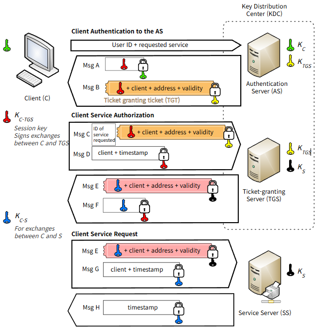

## Kerberos란 
Kerberos란 안전하지 않은 네트워크에서 사용자나 컴퓨터가 서로의 신원을 안전하게 인증하기 위해 사용하는 티켓 기반의 네트워크 인증 프로토콜이다.
Windows Server의 Active Directory 환경에서 자주 사용된다.
## Kerberos 구성 요소
* Client(USER) 
	* 세션을 설정하려는 컴퓨터 또는 사용자
* Service Server
	* Client가 통신하고자 하는 Service 제공 서버
* KDC(Key Distribution Center)
	* 인증 서비스를 제공하고 티켓 및 임시 세션 키를 제공하는 신뢰할 수 있는 제 3자의 역할을 하는 서버, AS(Authentication Server)와 TGS(Ticket Granting Server)로 구성
	* AS(Authentication Server)
		* Client가 전송한 인증 요청을 검증하고, TGT(Ticket Grant Ticket)을 발급해주는 서버
	* TGS(Ticket Granting Server)
		* AS로 부터 인증을 받은 Client가 특정 서비스에 접근할 수 있도록 해당 서비스의 티켓과 세션 키를 발급해주는 서버
## Kerberos 동작 순서
1. AS-REQ (Client > KDC/AS)
	- 클라이언트가 KDC에 인증 티켓 요청
	-  Client Name, Pre-Auth Data(Client Key로 암호화된 Timestamp)를 KDC에 전송
2. AS-REP (KDC/AS > Client)
	- KDC의 DB에서 사용자의 Client Key를 사용하여 Pre-Auth Data를 복호화하여 유효성 검증
	- krbtgt 계정의 키로 암호화된 TGT(Ticket Granting Ticket) Client에 전달
3. TGS-REQ (Client > KDC/TGS)
	- Client가 TGT를 이용하여 접근할 서비스(SPN)에 대한 Service Ticket 발급 요청
4. TGS-REP (KDC/TGS > Client)
	- KDC가 TGT를 복호화하여 유효한 사용자임을 검증 후 Service Ticket 발급
	- 이후 KDC가 Client에게 접근할 서비스 계정의 키로 암호화된 Service Ticket 전달
5. AP-REQ (Client > Service)
	- TGS로 부터 받은 Service Ticket을 접근할 Service 서버에 전달
6. AP-REP
	- Client로 부터 전달받은 Service Ticket을 검증하여 세션 수립

## 정리

| 단계                | 주요 목적     | 생성되는 티켓              | 이벤트 로그 ID | 이벤트 로그 설명              |
| ----------------- | --------- | -------------------- | --------- | ---------------------- |
| AS-REQ / AS-REP   | 사용자 인증    | TGT                  | 4768      | TGT 요청 및 발급            |
| TGS-REQ / TGS-REP | 서비스 접근 요청 | Service Ticket       | 4769      | Service Ticket 요청 및 발급 |
| AP-REQ / AP-REP   | 서비스 인증    | Session Key Exchange | 4624      | 서비스 접근 로그              |

